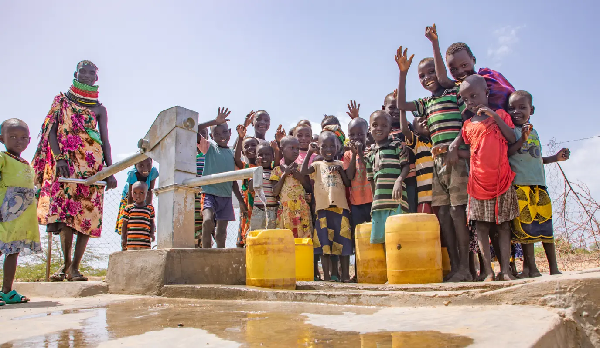

# Business Understanding
# TANZANIA WATER WELLS

#Image source google stock images.istockphoto.com

Phase 3 Project

#Please note that i ahve 2 ipynbs.

## Overview

Access to clean and safe drinking water is a fundamental human right and a critical aspect of sustainable development. In many regions of the world, including Tanzania, millions of people still lack access to reliable water sources, leading to numerous health, economic, and social challenges. Addressing this issue requires effective planning and resource allocation to ensure the sustainable provision of clean water to communities in need.

In the context of Tanzania, where water scarcity and inadequate infrastructure remain persistent problems, predictive modeling emerges as a promising approach to enhance water resource management and optimize the drilling of new wells. By leveraging historical data, advanced statistical techniques, and machine learning algorithms, we aim to develop a robust predictive model that can accurately estimate the potential success and yield of water wells across different regions in Tanzania.

---

### 1. Business Understanding

### Problem Statement

Despite efforts to improve water access in Tanzania, significant challenges persist in ensuring sustainable and reliable access to clean water for all communities. The lack of accurate predictive models for water wells hampers efficient planning and resource allocation, resulting in suboptimal drilling locations, unreliable well yields, and inadequate maintenance strategies. As a result, communities continue to face water scarcity, health risks from contaminated water sources, and economic hardships.

The existing approach to drilling water wells in Tanzania relies heavily on experience and local knowledge, which often leads to inconsistent results and ineffective resource utilization. Moreover, the scarcity of reliable data and the complex interplay of geological, hydrological, and climatic factors pose additional barriers to identifying suitable well locations and estimating their potential yield accurately.

#### Objectives

* Utilize advanced statistical techniques and machine learning algorithms to develop a robust predictive model for water wells in Tanzania. The model should accurately estimate the potential success rate and yield of water wells based on the identified influential factors.
* Conduct a thorough analysis of the dataset to identify the key factors that significantly impact the functionality of water wells in Tanzania.

#### Research Questions

* Which statistical techniques and machine learning algorithms are most suitable for building an accurate predictive model for water wells in Tanzania?
* How can the predictive model be validated and refined to ensure its reliability and practicality?

### Success Criteria

#### Business Success Criteria

* The predictive modeling project should lead to a measurable increase in the success rate of water well installations in Tanzania.
* The project should correctly identify functionality of a well and determine its viability.
* The success of the project should be measured by the satisfaction and adoption of the predictive model by key stakeholders, including policymakers, government agencies, and humanitarian organizations.
* The project should contribute to the long-term sustainability of water access in Tanzania. This can be assessed by evaluating the scalability and replicability of the predictive model.

#### Project Success Criteria

Generating a model that will be able to correctly predict the quality status of the wells in Tanzania with an accuracy of 80%.

---

## 2. Data Understanding

In this project we shall use a dataset containing information about existing water wells in Tanzania sourced from an ongoing DrivenData competition.

### 2.1 Data Description

The dataset contains 59,400 records and spans 40 columns. Of these columns, we identified 31 to be categorical, and 9 as numerical. We were able to further group the columns into the general features being captured. A description of all features can be found [here](https://www.drivendata.org/competitions/7/pump-it-up-data-mining-the-water-table/).

---

## 3. Data Preparation

This dataset analysis and classification will help our stakeholders to improve maintenance of the present water wells or give useful information for future wells.

### 3.1 Data Selection

I analyzed the data to identify the most relevant features that significantly influence the functinality of water wells. I achieved this by exploratory data analysis, correlation analysis, domain knowledge and selected a subset of features that exhibit strong relationships with well outcomes and discard irrelevant or redundant variables.

### 3.2 Data Cleaning

A number of the features overlap, including **waterpoint_type** and **waterpoint_type_group** as well as **extraction_type**, **extraction_type_group**, and **extraction_type_class**. Due to the same information being represented at several levels, these would cause multicollinearity concerns, hence in order to decrease the dimensionality of the data, the most generic columns for each overlapped column were retained.

 Checking for validity in the data, the dataset was checked for any duplicated values and outliers. The duplicated records were not dropped as it does not mean that they were similar wells but just built under the same project. We also chose not to drop the outliers, as it did not display erroneous data but will be further looked into in the analysis section. After cleaning the dataset, we need to bring uniformity by formatting and the columns to be readable and easily interpretable. So we defined functions to make these possible. Moreover, we verified that the values of various columns are consistent. The names of installers and funders had numerous instances of the same funder and/or installer, but with misspelt names and/or typographical errors.

---

## 4. Modeling

The "status_group" variable was my target I changed it from ternery into a binary format, typically indicating whether a water well is functional or non-functional, the categories "non- functional" and "functional needs repair" can be combined into a single category representing non-functional wells, while "functional" remains unchanged. I Label-Encoded the categorical variables and categorised the target.  Our baseline model was Dummy Classifier with the StandardScaler as our scaler, just to test how our chosen attributes would perform on a basic level. We then explored other more sophisticated models like the Decision trees,  Decision Tree with GridsearchCV,Support Vector Machine (SVM) classifier, K-Nearest Neighbors,K-Nearest Neighbors with grid search,Logistic regression. It was low at first giving 0.59 so perfoming feature engineering improved the moved accuracy by 14 % t0 0.73.

---

## 5. Evaluation

I used pipelines to scale the data and then fit it to the model. We then used cross validation to ensure that our model was not overfitting. We also used a confusion matrix to evaluate the performance of our mode. Our model performed moderately well predicting at most 78% of the functionality.

---

## 6. Conclusion

In conclusion, the findings suggest several important considerations for stakeholders when planning the construction and maintenance of wells in Tanzania. The Dodoma region has a higher number of non-functional wells compared to functional ones, indicating a need for careful assessment and investigation into the causes and potential solutions before building new wells. Data analysis shows that wells with operating permits tend to remain functional longer than those without permits, highlighting the importance of regulatory compliance. Furthermore, wells that are not associated with any payment plan often become inoperable due to public misuse; therefore, implementing a reasonable payment plan could help maintain well functionality. To ensure sustainable water access, stakeholders should focus on regions with higher failure rates, verify that all wells have the necessary permits, and consider the establishment of payment plans to enhance the viability of the wells.

## 7. Recommendations

1.Regular Maintenance and Repairs: To ensure continuous access to water, it is crucial to implement a robust maintenance schedule for functional wells and promptly repair those classified as needing repair or non-functional. Predictive maintenance, using insights from data analysis, can help optimize resource allocation and minimize pump downtime.

2.Improved Data Collection and Management: Enhance data collection practices to include more accurate and up-to-date information on well status, location, and usage. This will help in better decision-making and resource distribution for maintenance and repairs.

3.Community Involvement and Training: Engage local communities in the maintenance and management of water points. Training local users and managers can lead to quicker identification and reporting of issues, promoting sustainability and ownership.

4.Use of Advanced Machine Learning Models: The project should consider using advanced machine learning models like Random Forest or Gradient Boosting for better predictive accuracy regarding well functionality. Hyperparameter tuning, as done with GridSearchCV in the study, can further improve model performance.

